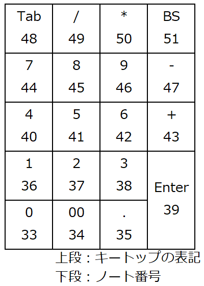
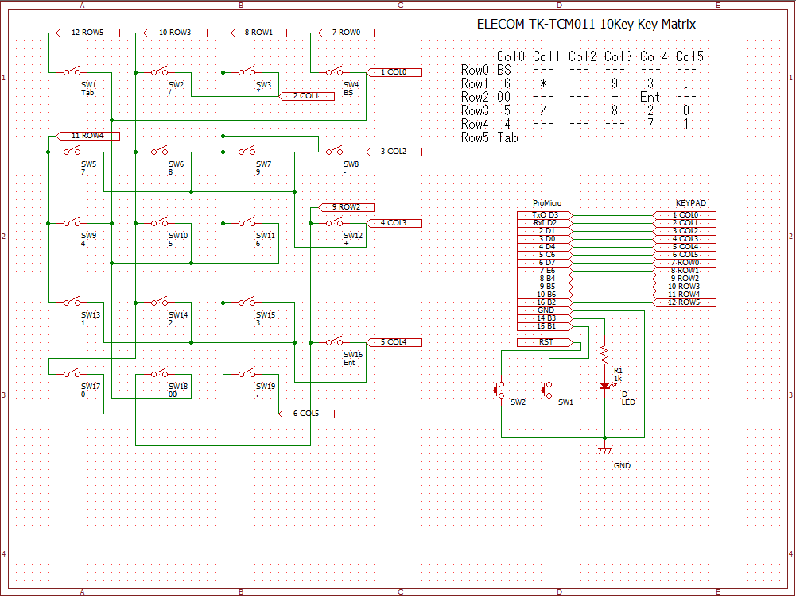
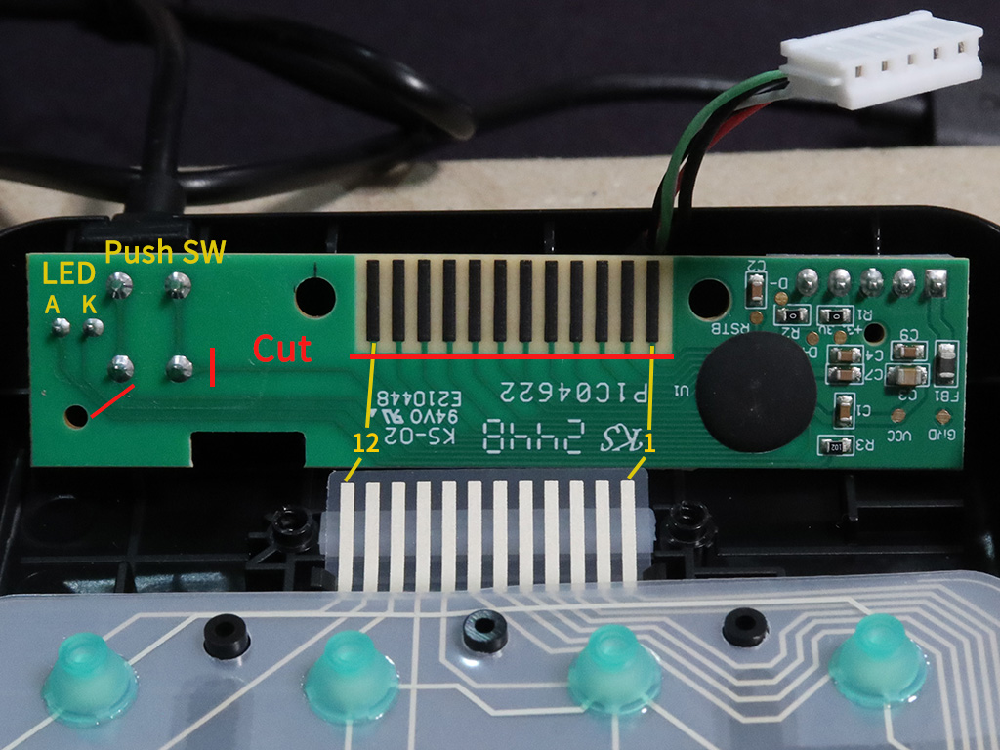
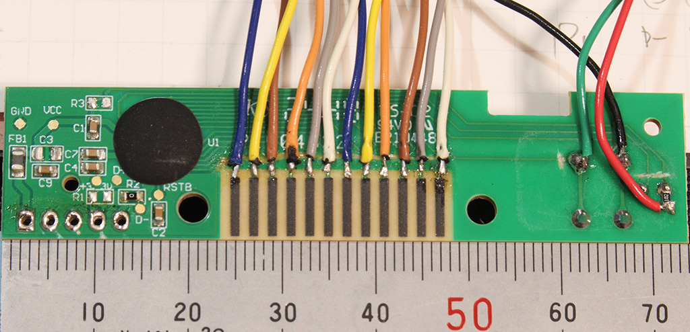
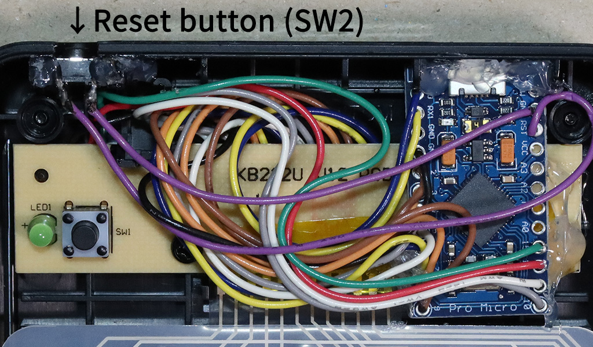

# ELECTOM TK-TCM011 MIDI化改造

* Keyboard Maintainer: [YuuichiAkagawa](https://github.com/YuuichiAkagawa)
* Hardware Supported: Arduino Pro Micro
* Hardware Availability: ELECOM TK-TCM011

## QMKの環境構築や使用方法については下記を参考に行ってください。QMK自体に関するサポートは行いません。
- [Complete Newbs Guide](https://docs.qmk.fm/#/newbs)
- [build environment setup](https://docs.qmk.fm/#/getting_started_build_tools)
- [make instructions](https://docs.qmk.fm/#/getting_started_make_guide)

## ソースコードの取得
qmk_firmware/keyboards ディレクトリに移動後、GitHubからcloneしてください。

    cd ~/mv tqmk_firmware/keyboards
    git clone https://github.com/YuuichiAkagawa/tk_tcm011_midi.git

## ビルド方法

    qmk compile -kb tk_tcm011_midi -km default

## 書き込み方法

    qmk flash -kb tk_tcm011_midi -km default

## ブートローダー
ファームウェア書換時はリセットボタンを押してください。

## キーマップ
  

## MIDI情報
- MIDIポート名 : tk_tcm011_midi
- MIDIチャンネル : 1

MIDIチャンネルを変更したい場合は、```keymap.c```の以下を修正してください。
```
// channel setting CH1(0)
midi_config.channel = 0;
```

## ハードウェア
  
  
  
  
